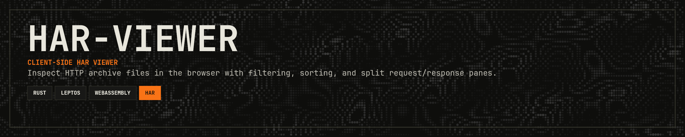

<p align="center">
  
</p>

<p align="center">
  <a href="https://www.rust-lang.org/"></a>
  <a href="https://opensource.org/licenses/MIT"></a>
  <a href="https://git.woldtech.nl/CrucifiedMidget/har-viewer/pulls"></a>
  <a href="https://har-viewer-ecru.vercel.app/"></a>
</p>

<p align="center">
  <a href="#overview">Overview</a> · <a href="#features">Features</a> · <a href="#requirements">Requirements</a> · <a href="#setup">Setup</a> · <a href="#run-development">Run</a> · <a href="#build">Build</a> · <a href="#test">Test</a> · <a href="#contributing">Contributing</a> · <a href="#license">License</a>
</p>

---

Client-side HAR viewer built with Rust, Leptos, and WebAssembly.

## Overview

`har-viewer` loads a HAR file in the browser and lets you inspect requests/responses with filtering, sorting, and split request/response panes.  
No backend is required.

## Features

- Local HAR import via file picker or drag-and-drop
- Indexed parsing for large HAR files
- Toolbar filters (search, method, status group, MIME)
- Sortable HTTP history table
- Split inspector for raw request and response messages
- Light/dark theme toggle

## Requirements

- Rust (stable)
- `wasm32-unknown-unknown` target
- Trunk (`cargo install trunk`)

## Setup

```powershell
rustup target add wasm32-unknown-unknown
```

## Run (development)

```powershell
trunk serve
```

Then open the local URL printed by Trunk (typically `http://127.0.0.1:8080`).

## Build

```powershell
trunk build --release
```

## Test

```powershell
cargo test
cargo check --target wasm32-unknown-unknown
```

## Project Structure

- `src/ui/` UI components and interaction logic
- `src/har/` HAR scanning, parsing, and message formatting
- `src/state/` app state and selection/sort/filter behavior
- `src/filter/` filter model
- `style/main.css` app styling
- `index.html` Trunk entry point

## Notes

- The app is intended to run in the browser. Running the native binary prints a message and exits.

## Contributing

Contributions are welcome! Please feel free to submit a Pull Request.

1. Fork the repository
2. Create your feature branch (`git checkout -b feature/cool-feature`)
3. Commit your changes (`git commit -m 'Add some cool feature'`)
4. Push to the branch (`git push origin feature/cool-feature`)
5. Open a Pull Request

## Support

If this crate saves you time or helps your work, support is appreciated:

[](https://ko-fi.com/11philip22)

## License

This project is licensed under the MIT License; see the [license](https://opensource.org/licenses/MIT) for details.
